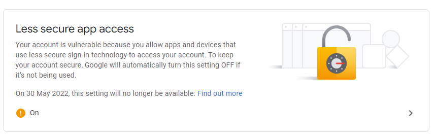
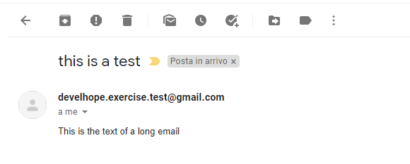

# Exercise - Spring Boot - Email 1
* create a custom Gmail account using a new email and a new password (do not publish them on GitHub or other public places!)
* in order to use Gmail's SMTP you have to allow `Less secure apps` (you can find the option in the new Google account security settings)
  * see following picture:

* if Gmail is not allowing you to have `Less secure apps`, you can use a service like [SendGrid](https://sendgrid.com/)
* write a Spring Boot application with the necessary dependencies that:
  * has all the necessary email SMTP configuration in `application.yml`
  * defines an entity `Student` with the following string properties:
    * `id`
    * `name`
    * `surname`
    * `email`
  * defines a `StudentService` that has:
    * a list of 4 `Student`s, where the first one is you (with your email)
    * a method `getStudentById` that returns the `Student` if it's present in the list
  * exposes under the mapping `notification` an endpoint for sending an email to a specific `Student`
    * use a `try/catch` in the dedicated controller
    * if the id of the `Student` is already in the list, then send the email to that user
    * if not, reply with a `BAD_REQUEST` message
    * if the request is not correct, reply with an error 500 HTTP response
  * defines a `NotificationDTO` that consists of the following strings:
    * `contactId`
    * `title`
    * `text`
* test the endpoint with `Postman`:
  * send email to a user that is present in the list (you!)
  * try to send email to a user that is not present in the list
  * try to send email with a wrong payload
* you should receive an email like this:

* **note for reviewers**: view `Email1.postman_collection.json` in the root folder for all the `Postman` calls
